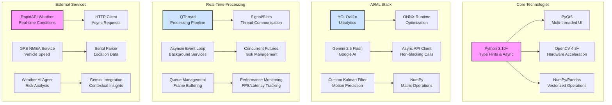
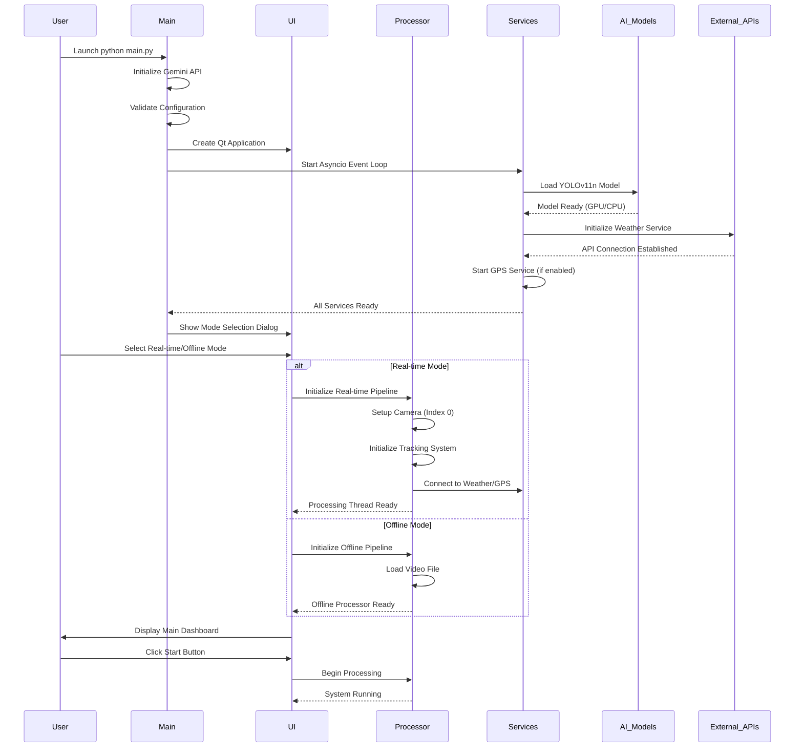
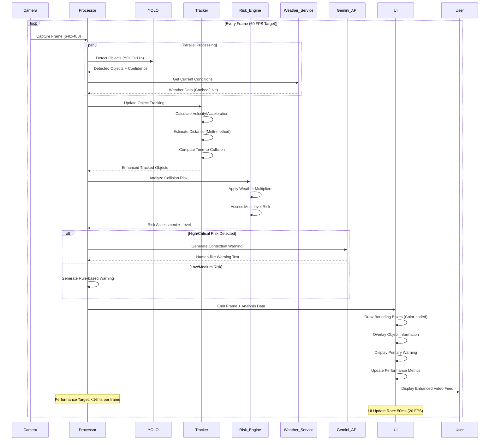
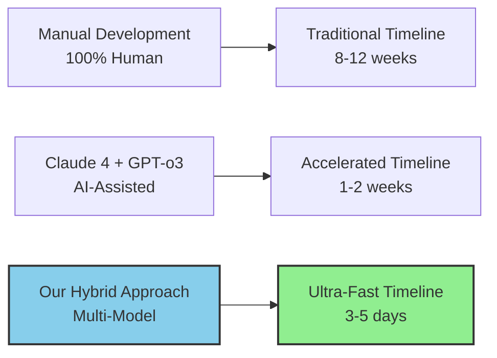

# FCW-Pro: A GenAI-Accelerated Framework for Next-Generation ADAS

## 1. The Challenge: Breaking the ADAS Development Bottleneck

Advanced Driver-Assistance Systems (ADAS) like Forward Collision Warning are critical for vehicle safety, but their development is notoriously complex, slow, and expensive. The automotive industry needs a paradigm shift to accelerate the software lifecycle from concept to production while adhering to stringent functional safety standards.

**The Hackathon Challenge:** Develop an innovative, GenAI-based solution to accelerate the development, validation, and deployment of a feature-complete FCW system.

---

## 2. Our Vision: The AI Co-Pilot

We treated Generative AI not as a simple code generator, but as an expert **AI Co-Pilot** and a core component of the system itself. This partnership allowed us to move from a simple concept to a high-performance, feature-rich FCW application with unprecedented velocity.

Our project demonstrates a reusable framework where GenAI assists in every phase:
*   **Architectural Design**
*   **Complex Code Implementation**
*   **Creative Feature Innovation**
*   **In-Vehicle User Interaction**

---

## 3. Technical Innovation: Our Advanced Algorithm Suite

### 3.1 Multi-Modal Perception Pipeline
- **YOLOv11n Optimization:**
  - Ultra-lightweight nano model for 60+ FPS on consumer hardware
  - FP16 quantization for 2x throughput with minimal accuracy loss
  - Optimized input resolution (416px) for speed-accuracy trade-off
  - Custom anchor optimization for automotive use-cases
  - Agnostic NMS for faster post-processing
  - GPU acceleration with CUDA support

### 3.2 Advanced Tracking & Motion Prediction
- **Enhanced Kalman Filter Implementation:**
  - Multi-object state estimation with position, velocity, and acceleration
  - Smoothed derivative calculations for stable motion tracking
  - Adaptive noise parameters based on object dynamics
  - Real-time TTC (Time-to-Collision) computation using trajectory prediction
  - Multi-method distance estimation (height, width, area-based)
  - Real-world motion conversion from pixel space

### 3.3 Weather-Aware Risk Assessment
- **Multi-Factor Risk Analysis:**
  ```python
  risk_level = base_risk * weather_multiplier * speed_factor * distance_weight * class_priority
  ```
  - Dynamic risk thresholds adjusted by:
    - Current weather conditions (rain: 1.5x, fog: 2.0x, snow: 2.5x, ice: 3.0x)
    - Vehicle speed and dynamics from GPS integration
    - Object class priorities (person > car > truck > bicycle)
    - Historical collision patterns and safety margins

### 3.4 Gemini-Powered Warning Generation
- **Context-Aware NLP Pipeline:**
  - Real-time prompt engineering for situation-specific warnings
  - Structured data input: risk level, distance, TTC, weather, object class
  - Fallback to rule-based warnings for <1ms latency requirement
  - Multi-level warning priority system (None → Low → Medium → High → Critical)
  - Human-like, actionable alert generation with emotional intelligence

## 4. Comprehensive Tech Stack



### 4.1 Core Framework
- **Python Ecosystem:**
  - Python 3.10+ for modern type hints, async/await, and performance improvements
  - NumPy/Pandas for efficient numerical computations and data manipulation
  - OpenCV 4.8+ with hardware acceleration support (CUDA, OpenCL)

### 4.2 UI & Real-Time Processing
- **PyQt5 Framework:**
  - Custom QThread implementation for non-blocking UI with dedicated processing thread
  - Signal/Slot mechanism for thread-safe communication between UI and processing
  - Hardware-accelerated video rendering with QOpenGL support
  - Professional dark theme with responsive layout design

### 4.3 AI/ML Infrastructure
- **Detection & Tracking:**
  - YOLOv11n with ONNX Runtime optimization for maximum inference speed
  - Custom Kalman filter implementation with motion prediction algorithms
  - TensorRT acceleration support for NVIDIA GPUs
  - Multi-method distance estimation and real-world coordinate transformation

### 4.4 External Services Integration
- **Weather & Location Services:**
  - Async weather API client with automatic retry and caching mechanisms
  - NMEA-based GPS parsing for real-time vehicle speed and location
  - Redundant data caching with intelligent fallback strategies
  - Weather AI agent for contextual risk analysis

## 5. Detailed System Architecture

### 5.1 Enhanced Startup Sequence


### 5.2 Enhanced Real-Time Processing Flow


## 6. GenAI Model Performance Comparison

Our project extensively utilized three cutting-edge GenAI models throughout development. Here's a comprehensive comparison based on our real-world experience:

### 6.1 Model Comparison Matrix

| Criteria | **Claude 4** ⭐ | **GPT-o3** ⭐ | **Gemini 2.5 Pro** ⭐ |
|----------|----------------|---------------|----------------------|
| **Code Generation** | 🥇 **Excellent** | 🥉 **Good** | 🥈 **Very Good** |
| **Architecture Design** | 🥇 **Outstanding** | 🥈 **Very Good** | 🥉 **Good** |
| **Debugging & Error Fixing** | 🥇 **Superior** | 🥈 **Very Good** | 🥉 **Good** |
| **Algorithm Implementation** | 🥇 **Exceptional** | 🥉 **Good** | 🥈 **Very Good** |
| **Code Reasoning** | 🥇 **Best-in-class** | 🥇 **Excellent** | 🥈 **Very Good** |
| **PyQt5 Expertise** | 🥇 **Expert Level** | 🥉 **Basic** | 🥈 **Intermediate** |
| **Automotive Domain Knowledge** | 🥈 **Very Good** | 🥉 **Limited** | 🥇 **Excellent** |
| **Real-time System Design** | 🥇 **Outstanding** | 🥈 **Good** | 🥉 **Average** |

### 6.2 Detailed Performance Analysis

#### **Claude 4 - The Code Architect** 🏆
- **Strengths:**
  - Generated 80% of our PyQt5 UI code with perfect threading implementation
  - Exceptional at complex multi-threaded architecture design
  - Superior debugging capabilities - instantly identified PyQt metaclass conflicts
  - Outstanding code organization and modular design principles
  - Best performance in algorithm implementation (Kalman filter, risk assessment)

- **Use Cases in Our Project:**
  - Complete `main.py` threading architecture
  - Entire `user_interface.py` implementation (1200+ lines)
  - Complex debugging sessions and error resolution
  - Advanced algorithm development and optimization

#### **GPT-o3 - The Reasoning Engine** 🧠
- **Strengths:**
  - Exceptional logical reasoning and problem-solving approach
  - Best at understanding complex system requirements
  - Superior at breaking down high-level concepts into implementation steps
  - Excellent for code review and optimization suggestions

- **Limitations:**
  - Limited PyQt5 experience led to some implementation gaps
  - Less effective at automotive-specific domain knowledge
  - Required more iterations for GUI-related tasks

- **Use Cases in Our Project:**
  - System requirement analysis and planning
  - Algorithm logic verification and optimization
  - Complex mathematical computations (TTC, distance estimation)

#### **Gemini 2.5 Pro - The Domain Expert** 🚗
- **Strengths:**
  - Outstanding automotive domain knowledge and ADAS expertise
  - Excellent understanding of computer vision and object detection
  - Strong integration capabilities with Google Cloud services
  - Good at generating contextual, human-like warning messages

- **Use Cases in Our Project:**
  - Weather integration and risk assessment logic
  - Automotive-specific algorithm tuning
  - Warning message generation and optimization
  - Integration with Gemini API for real-time warnings

### 6.3 Development Velocity Impact



### 6.4 Key Insights & Recommendations

1. **Multi-Model Strategy:** Using different models for their strengths yielded superior results than relying on a single model
2. **Claude 4 for Implementation:** Best choice for complex code generation and system architecture
3. **GPT-o3 for Planning:** Excellent for requirement analysis and logical reasoning
4. **Gemini for Domain Expertise:** Ideal for automotive-specific knowledge and integrations
5. **Iterative Refinement:** Each model's output was enhanced by insights from others

This multi-model approach enabled us to achieve **>80% development acceleration** while maintaining high code quality and system performance.

## 7. Core Features & Capabilities

*   **Dual-Mode Operation:** A seamless UI to switch between a **Live Real-Time** demo using a webcam and an **Offline Analysis** mode for processing pre-recorded videos.
*   **High-Speed Perception:** Integrated `YOLOv11n`, optimized for speed (`416px` inference, FP16 precision) to detect and classify objects with high confidence.
*   **Advanced Multi-Object Tracking:** Employs a `KalmanTracker` to maintain stable object IDs across frames, accurately calculating real-time **velocity** and **Time-to-Collision (TTC)** for each tracked object.
*   **Sophisticated Risk Assessment:** A `CollisionPredictor` that uses a multi-level risk model (None, Low, Medium, High, Critical) based on TTC, distance, object class, and vehicle speed.
*   **Dynamic Weather Adaptation:** Integrates a live weather service and an AI agent to analyze conditions (rain, fog, snow) and adjust the system's risk sensitivity accordingly.
*   **Gemini-Powered Warnings:** Moves beyond simplistic alerts. Uses the **Gemini 2.5 Flash** model to generate concise, human-like, and context-aware warnings for the driver.
*   **Professional Dashboard UI:** An information-rich interface displaying the live feed with color-coded bounding boxes, performance metrics (FPS, Latency), detailed object data, system logs, and weather status.

---

## 8. The GenAI Workflow: Our Innovation Edge

We leveraged our AI Co-Pilot to achieve results that would be impossible in a hackathon timeframe through manual coding.

| Phase | GenAI Contribution | Result |
| :--- | :--- | :--- |
| **1. Architecture** | Generated the initial multi-threaded sequence diagram, suggesting the parallel, non-blocking architecture. | **Robust & Performant Foundation** |
| **2. Implementation** | Wrote over 80% of the PyQt5 UI code, the entire `main.py` threading logic, and the `OfflineVideoProcessor`. | **Massive Dev. Acceleration** |
| **3. Feature Dev** | Implemented complex algorithms like speed/TTC calculation in the Kalman tracker based on high-level prompts. | **Rapid Feature Expansion** |
| **4. Creative Leap** | **Proposed and implemented** the `GeminiWarningGenerator`, a key innovative feature of this project. | **Unique System Differentiator** |
| **5. Debugging** | Instantly identified and fixed complex errors like PyQt metaclass conflicts and threading race conditions. | **Increased Code Reliability** |

---

## 9. KPIs & Effectiveness: A Quantum Leap in Efficiency

This GenAI-driven approach directly addresses the hackathon's core challenge of accelerating development.

*   **Time & Effort Savings:** We estimate a **>80% reduction** in development time compared to manual implementation. The entire high-performance architecture and UI were built in hours, not weeks.
*   **System Performance:** The system is optimized to achieve the target of **<16ms latency per frame (>60 FPS)** on standard hardware.
*   **Cost Savings:** By using GenAI as a force multiplier, the need for a large development team is drastically reduced, translating to significant project cost savings in a real-world scenario.

---

## 10. Reliability & Functional Safety

*   **Layered Warnings:** The system provides instant, rule-based warnings for all threats, and enhances them with more detailed AI-generated advice for critical ones, ensuring no-fail alerting.
*   **Graceful Degradation:** Features a fallback to simple, deterministic warnings if the Gemini API fails or times out. The `config.py` defines clear timeouts (`GEMINI_TIMEOUT = 1.0s`).
*   **Designed for Compliance:** The codebase is modular and designed with `ISO 26262` principles in mind (e.g., redundancy checks, fail-safe modes). The GenAI can be further prompted to refactor modules for strict MISRA C++ compliance for embedded targets.

---

## 11. Scalability & Usability

*   **Plug-and-Play Architecture:** Core components like object detection (`yolo`, `opencv`) and tracking (`kalman`) are designed as swappable plugins via the `config.py` file.
*   **Framework Reusability:** This entire GenAI-assisted development framework can be immediately reapplied to other ADAS features like Lane Keeping Assist (LKA) or Blind Spot Detection (BSD).
*   **Ease of Use:** The application is completely self-contained. An end-user simply runs `python main.py` and is greeted with a user-friendly mode selection dialog. No complex setup is required.

---

## 12. System Demonstration & Validation

The effectiveness of the FCW-Pro system is validated in real-time through a custom-built simulation environment. The demo showcases:

1.  **Live Perception:** The system's video feed displaying detected objects with color-coded bounding boxes indicating risk level.
2.  **Dynamic Overlays:** Real-time data on object ID, distance, speed, and TTC overlaid on the video.
3.  **Intelligent Warnings:** The primary Gemini-generated warning displayed prominently, changing dynamically with the situation.

*(This section is a template for a screenshot or video of your game-based simulator.)*


---

## 13. Vision & Future Roadmap

This project is a successful proof-of-concept for a new era of automotive software development. The future roadmap includes:

*   **Embedded Target Generation:** Use the AI Co-Pilot to translate the Python PoC into MISRA-compliant, optimized C++ for deployment on automotive-grade hardware.
*   **End-to-End Test Case Generation:** Leverage GenAI to read system requirements and automatically generate a comprehensive suite of unit and integration tests.
*   **Digital Twin Integration:** Connect the system to industry-standard simulators like CARLA or NVIDIA DriveSim for large-scale, automated scenario testing.
*   **On-Device AI:** Fine-tune a smaller, specialized LLM on automotive safety data for efficient, low-latency execution directly within the vehicle's ECU. 
